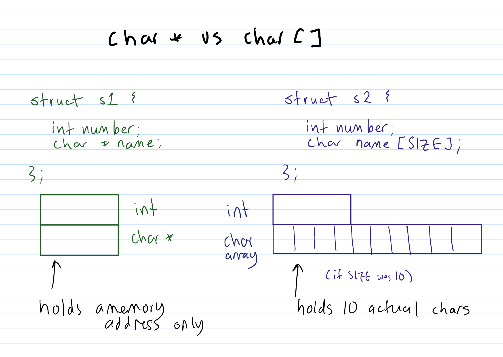
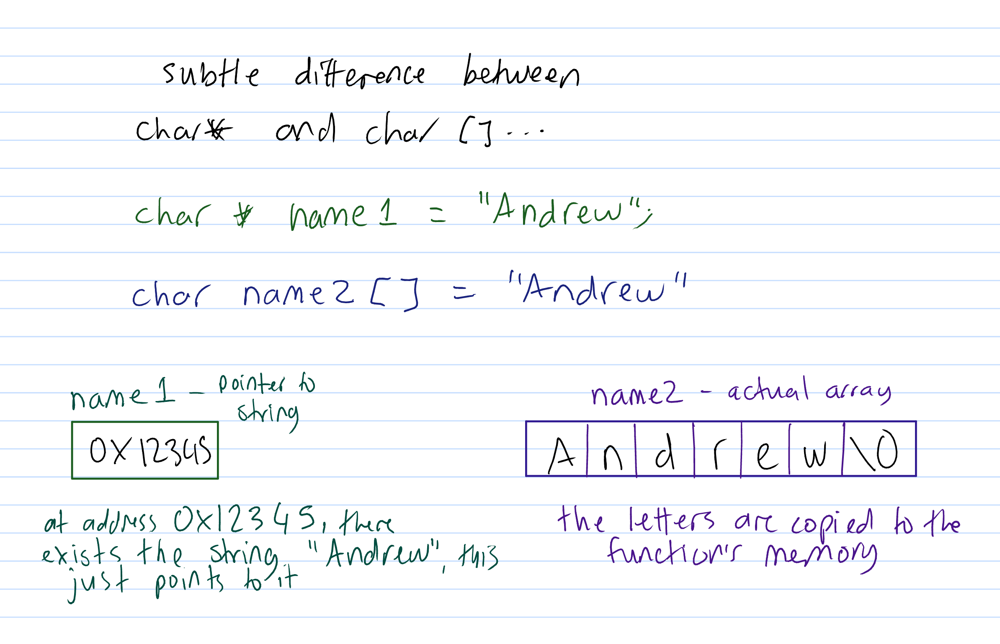

**Student**: I have this code in one of my unit tests, and it gives me a
segmentation fault. Why?

```c
struct student {
    char *name;
    int zID; 
};
struct student *student = malloc(sizeof(struct student));
strcpy(student->name, "Apples");
```
----

**Andrew**: I'm guessing that `student->name` is a `char *`, rather than an
actual array -- so you're trying to copy it into memory that doesn't
exist.

Try just going `student->name = "Apples";` instead.

----

**Student**: Doesn't "Apples" give the array `{'A', 'p', 'p', 'l', 'e',
's', '\0'}`?  And I thought we should always use strcpy when "assigning"
strings?

----

**Andrew**:
> Doesn't "Apples" give the array `{'A', 'p', 'p', 'l', 'e', 's', '\0'}`?

Sort of -- I think this is easier to explain with a diagram, so give me
a few mins...

----

**Andrew**:
Okay, so hopefully you can read my handwriting....

I'm guessing that you're expecting "name" (in the student struct) to be
like the one on the right -- there's an actual array inside the struct
itself, wherein you can put characters, so like `'A' 'p' 'p' 'l' 'e'
's'`.



When we have something like 

`char name[] = "Apples"` then yes, it copies the characters into the
function's memory -- there is an actual array inside the function's
memory, and it now contains the characters 'A' 'p' 'p' etc.

When we have something like `char *name = "Apples"` then we're not
actually copying the letters anywhere, we're just saying that `name`
should have the memory address of somewhere that has the string
"Apples".

In terms of how (modern?) C programs work, the compiler will actually
put the literal string "Apples" in the compiled code of your program,
which it loads into memory when your program is run, and so `name` here
would have the memory address of that place in memory where the string
"Apples" is.

It also means that if I did this:

```c
char *lecturer1 = "Andrew"
char *lecturer2 = "Andrew"
```

it's possible (but not guaranteed) that these would both end up pointing
to the one "Andrew" in memory, so `lecturer1 == lecturer2` would be true.

(note that if we had `char lecturer1[] = "Andrew"` and `char lecturer2[]
= "Andrew"` they would not be equal, because you're now trying to
compare two different actual character arrays, which you need to use
strcmp to do character-by-character)



Hopefully that makes sense?

----

**Student**: Thanks heaps.
So why doesn't `strcpy(student->name, "Andrew");` work?
Isn't it just like doing `student->name = "Andrew"`?

----

**Andrew**:
So, strcpy literally goes character-by-character across and copies from
one thing to the other.

The implementation might look something like this:

```c
char *strcpy(char *dest, const char *src) {
   int i = 0
   while (src[i] != '\0') {
       dest[i] = src[i];
       i++;
   }
   return dest;
}
```
(slightly modified from what `man 3 strcpy` gives)

If you want to copy stuff from one character array to another character
array, you need to use something like strcpy to copy every single letter
one at a time.

If you want to make a pointer point to the same place as another
pointer, you can just go `pointer2 = pointer1`

**Student**: I see, thanks! I've been using strcpy for this sort of
stuff in my assignment and haven't gotten errors until I started
unit-testing... so I was super confused

