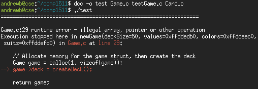

## A far-too-frequent and hard-to-debug memory allocation problem\...

There you are, working happily on your Game ADT implementation, when all
of a sudden you get the dreaded _illegal array, pointer, or other
operation_!

You have a look at what `dcc` is complaining about, and it makes no
sense:



Your code looks perfectly fine: you allocate some memory for the game,
and then set one of the fields in the struct. But, `dcc` doesn't like
this! For some reason, it thinks it's invalid to access the `deck` field
of your game struct.

Why could that be?


_(sidenote: you probably won't see anything
crash/complain here if you've compiled with gcc or clang -- dcc is
stopping you from doing something illegal, which coincidentally might
not seem to cause any problems when you run it without dcc)_


### What's going on?

It's possible that the memory allocation failed, and so `game` is
   `NULL`.

- This is very unlikely, but worth considering just in case...
- To do this, you should always check that malloc/calloc didn't
  return `NULL` after you've allocated memory.
- _(I've skipped that here so that all of the code fits in the
  screenshot)_


It's possible that trying to access that part of memory is illegal for
some other reason.

If you think about it -- what could cause that? You've (hopefully!)
learned enough in COMP1511 thus far to know that it's illegal to access
off the end of an array -- the same is true about trying to access past
the end of a memory allocation.

_"But why would this be accessing off the end of the memory
allocation?"_, you might ask.

Look very carefully at the memory allocation in that code:

```c
Game game = calloc(1, sizeof(game));
```

There is a subtle bug there, which is very easy to overlook.

To make it easier to see, here are a few other equivalent ways to
allocate the same amount of memory:

```c
// As above: note that "game" is being interpreted as the *variable*, rather than
// a type (so it refers to the type Game, which is a pointer to game struct)
Game game = calloc(1, sizeof(game));

// using malloc rather than calloc -- same thing, though.
Game game = malloc(sizeof(game));

// sizeof(Game) -- capital-G Game is a pointer to a game struct
Game game = malloc(sizeof(Game));

// sizeof(struct game *) -- explicitly a pointer to a game struct
Game game = malloc(sizeof(struct _game *));
```

Hopefully you've spotted it by now: how much memory does each of these
allocate?

_(hint: the amount of memory required for a **pointer**)_.

How much memory does the game struct need?

_(hint: enough to fit everything in the game struct; a **lot** more than
just a single pointer)_


So, then, what's happening here is:

1. `Game game = calloc(1, sizeof(game));`
    - `newGame` allocates enough memory for a single pointer (rather than
      the full game struct), and stores a pointer to that memory in
      `game`.
2. `game->deck = createDeck();`
    - The `deck` field of the game struct is accessed, to store the
      return value of `createDeck`.
    - But, because there wasn't enough memory allocated to store the
      entire game struct, this is accessing off the end of the
      allocated memory.
    - Trying to access past the end of a memory allocation is illegal in
      C, and so `dcc` stops you.

### How can you fix this?

The solution is simply to allocate enough memory to fit the entire game
struct.

You can do this by either explicitly asking for enough memory to fit the
game struct (recommended):

```c
Game game = malloc(sizeof(struct _game));
```

Or by asking for enough memory to store the size of what you'd get if
you dereferenced the `game` variable:

```c
// the key part here is the * before game
Game game = malloc(sizeof(*game)); 
```


