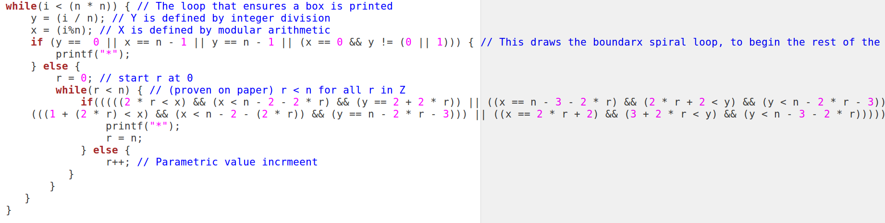
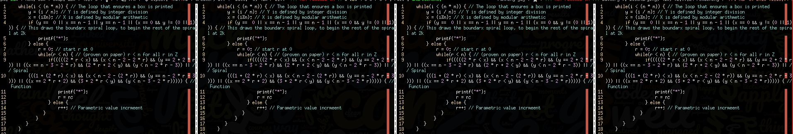
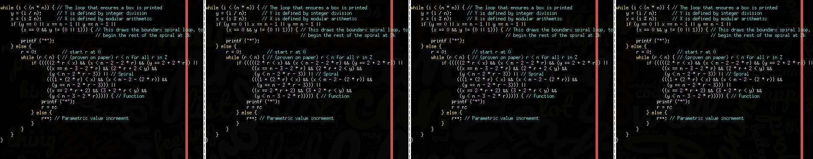
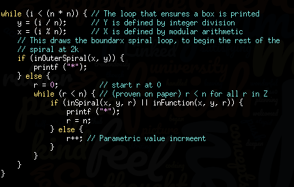

### Overview

1. Breaking up long if statements
1. Writing readable code
1. Function names and comments
1. Readability vs efficiency
1. Breaking up a very complicated piece of code into functions

### Breaking up long if statements
##### Student:
Which style is better?

I'm wondering which one of this is preferred:

1: a long statement with && \|\|

e.g. `(jhsjdh && whjhjr && dfhhdhfdhdkkj&& fjhufhh) ||(aghjGHASGFS &&
dshfhjasf && dkjfkkdg) ||(hfgdsfhj && fhasjfhu) || (hhfkjshf)`

2: break the above statements down by using if and else if ( which takes
more lines)

----

##### Andrew:

Using more lines is (usually) never a bad thing.

There is also a requirement in the style guide that lines not be more
than 80 characters wide. If your line is hundreds or even thousands of
characters wide, you will have serious style marks deducted.

That said, I wouldn't consider something like this to be very good
style, whether or not you split it across multiple lines:

```
if ((.......... && .......... && .........) ||
    (........&& ..........) || (........ || ........) ||
    (.......... && ....... && ........)) {
    // do something
}
```
Having a long chain of if statements like that isn't very readable.

A better way to do it might be to put the logic of those if statements
into a function, and instead make your code be like

```c
if (someFunction(....)) {
    // do something
}
```
And then inside `someFunction`, making the code be more readable in
there too, e.g. this would not be very good style:

```c
int someFunction(...) {

    int something = FALSE;

    if ((.......... && .......... && .........) || 
        (........&& ..........) || (........ || ........) || 
        (.......... && ....... && ........)) {

        something = TRUE;
    }

    return something;
}
```
It would make more sense to break it up further to be more readable,
e.g.

```c
int someFunction(...) {
    int something = FALSE;
    if (.......) {
        something = TRUE;
    } else if (.....) {
        something = TRUE;
    } else if (......) {
        // etc etc etc
    }
    return something;
}
```
You wouldn't necessarily have to break every single condition into a
separate if statement, but you should be able to do it sensibly.

Thinking back to the leapYear example, you could write something like
this...

```c
if (year % 400 == 0) {
    isLeapYear = TRUE;
} else if (year % 100 == 0) {
    isLeapYear = FALSE;
} else if (year % 4 == 0) {
    isLeapYear = TRUE;
} else {
    isLeapYear = FALSE;
}
```

Or something like this...

```c
if (((year % 4 == 0) && (year % 100 != 0)) || (year % 400 == 0)) {
 isLeapYear = TRUE;
} else {
 isLeapYear = FALSE;
}
```
They both achieve the same thing, but reading the first one is (in my
opinion) significantly clearer than the second one.

------------------

> So if we are unable to use the multiple if statement version of this
> and our statement is made up of 5 &&'s or something like that what is
> the best thing to do style-wise, aside from using a function since the
> code would still be messy within the function anyway?

You can make the if statement chain within the function clearer (see the
leap year example above).

Taking your example:

```c
// Without limit
if (condition1 == num1 && condtion2 < num2 && condtion4 != num3 && condition5 == num5) {
    variable1 = 1;
} else if (condition6 == num6 && condition7 < num7 && condition8 != num8 && condition9 % 2 == 0) {
    variable1 = 2;
} else if (condition10 == num10 && condition11 < num11 && condition12 != num12) {
    variable1 = 3;
else {
    variable1 = 0;
}
```

This could become:

```c
if (the_sky_is_blue(...)) {
    variable1 = 1;
} else if (it_is_raining(...)) {
    variable1 = 2;
} else if (the_sun_is_on_fire(...)) {
    variable1 = 3;
else {
    variable1 = 0;
}
```

And then the functions could become something like:

```c
// this is one example of how you could structure the if statement within a function
int some_thing_to_check(...) {
    return (condition1 == num1
        && condtion2 < num2
        && condtion4 != num3
        && condition5 == num5);
}

// could also structure it like this
int some_other_thing_happened(...) {
    return condition6 == num6 &&
           condition7 < num7 && 
           condition8 != num8 && 
           condition9 % 2 == 0;
}

// or something like this (or any other number of ways)
int the_sun_is_on_fire(...) {
    int is_on_fire = FALSE;
    if (condition10 == num10
        && condition11 < num11
        && condition12 != num12) {

        is_on_fire = TRUE;
    }

    return is_on_fire;
}
```

-------------------

-------------------

-------------------

### Writing Readable Code

> The style guide says:
> "Break long lines up to keep them under 80 characters, unless keeping it as a longer line is significantly more readable."
>
> What does it mean by "significantly" more readable. For example I have a line like this: 
```c
int counter2 = 0; //Counter which will be used for cards used in current round
```
>

**Inline comments**:

Please don't use inline comments in your code like that -- comments
should go on the line above the relevant thing, rather than on the same
line.

So, in your example, it would become this:

```c
//Counter which will be used for cards used in current round
int counter2 = 0;
```
However, in general, if you feel like you need to have comments within
your code like that, then often that's a sign that you should rewrite
your code to be clearer so that it doesn't need to be commented in order
to be understand.


---

In terms of more general feedback (extrapolating on what you've posted
and what I think it could mean)

**Declaring variables**

Don't declare all of your variables at the top like that -- declare
them when you first "use" them.

This also helps avoid the need to comment what they are or what they're
used for, because they're declared in the context that they're going to
be used, and so within that context the name should (hopefully) make
sense.

**Variable names**

Make sure that your variables all have sensible, descriptive names.

With the example I've written below, the variable names for things
like arrays and sizes of the arrays all describe what they're doing --
because those variables all have some inherent meaning (e.g. the fruit
array is used to store fruit), and so the variable name describes that
inherent meaning.

For the loop counters, I've used `i` for all of them, because the loop
counters don't have any meaning beyond the fact that they're loop
counters, and `i` is the conventional name for a loop counter, so when
somebody reads your code they see `i` and think "ah yes, the loop
counter". There's no need to use a name like "counter".

(side note to that: if you think back to things where you were printing
squares and boxes etc, in that case your loop counters referred to the
rows and columns. It would be sensible to call those loop counters
`int row` and `int col`, because they do have meaning beyond just being
arbitrary loop counters -- they refer to the current row and the current
column. But for general loop counters that don't refer to anything
specific like that, just calling them `i` is best.)


**#defined constants**

Related to the previous one -- make sure that you use #defines for any
constants. So rather than making an array be something like
`int fruit[10]`, instead make it be `int fruit[MAX_FRUIT_TYPES]` or
whatever.

Again, this helps make your code more readable, and avoids the need to
have comments.


---

**Example**

To help illustrate what I mean:

If you imagine something similar to the assignment's function to choose
which cards to discard, but instead about a fruit+vege shop rather than
a card game:


```c
// ADD CODE TO READ THE FIRST THREE NUMBERS WHICH ARE:
// NUMBER OF VEGETABLES, NUMBER OF FRUITS, SHOP NUMBER

int num_vegetables, num_fruits, shop_number;
scanf("%d %d %d", &num_vegetables, &num_fruits, &shop_number;


// ADD CODE TO READ THE VEGETABLES INTO AN ARRAY
// YOU WILL NEED TO USE A WHILE LOOP AND SCANF
int vegetables[SOME_SENSIBLE_HASH_DEFINED_CONSTANT];
int i = 0;
while (i < num_vegetables) {
    // scan the vegetables into the array
    i++;
}

// ADD CODE TO READ THE FRUITS INTO AN ARRAY
// YOU WILL NEED TO USE A WHILE LOOP AND SCANF
int fruits[SOME_SENSIBLE_HASH_DEFINED_CONSTANT];
i = 0;
while (i < num_fruits) {
    // scan the fruits into the array
    i++;
}
```


Of course, those shouty all-caps comments are just there to tell you
what to do, and so you should remove them once you've done that part,
which would leave me with this code:

```c
int num_vegetables, num_fruits, shop_number;
scanf("%d %d %d", &num_vegetables, &num_fruits, &shop_number;

int vegetables[MAX_VEGE_TYPES];
int i = 0;
while (i < num_vegetables) {
    // whatever code needed to scan the vegetables into the array
    i++;
}

int fruits[MAX_FRUIT_TYPES];
i = 0;
while (i < num_fruits) {
    // whatever code needed to scan the fruits into the array
    i++;
}
```

Nothing anywhere in that code needs any comments at all, and adding
comments would just be redundant.

You can tell from looking at the arrays, for example, exactly what
they're storing. You can tell what the size variables mean, so adding a
comment next to them saying something like "the number of vegetables in
the shop" -- it's obvious from context and the name that a variable
called "num_vegetables" in a program about a fruit+vege shop refers to
the number of vegetables in the shop.

Both loops use the loop counter `i`, and this is the best thing to do
when you have multiple loops one after the other -- there's no point
making a new loop counter "j" and "k" etc for subsequent while loops,
unless you have to (e.g. unless the loops are nested inside each other,
so you need more than one loop counter).

----

There are further improvements that you could make on that code, if you
wanted to: one that stands out would be to make a function that scans in
the array values, rather than having a new loop each time to do it.

This would make the code look like:

```c
int num_vegetables, num_fruits, shop_number;
scanf("%d %d %d", &num_vegetables, &num_fruits, &shop_number;

int vegetables[MAX_VEGE_TYPES];
scan_array(vegetables, num_vegetables);

int fruits[MAX_FRUIT_TYPES];
scan_array(fruits, num_fruits);
```

You can see that I've now turned what was originally > 20 lines into six
lines of code -- and each of those six lines describes exactly what it
does.

---

**Abstraction**

In my opinion, the goal for writing well-styled code is to have it read
"like a book" -- so I read through the function and the code describes
_what_ the function is doing, but not _how_ it does it.

For example -- I call the `scan_array` function on my vegetables array.
This is describing that my function scans in the vegetables, and stores
them in the vegetables array.

When I'm reading through this function, I don't really care _how_ it
scans them in -- I don't need to see the details of how the loop works
that scans them in.

The only thing that I'm interested in is _what_ the code is doing -- and
it's very clear that it's scanning in the vegetables and fruits into
their respective arrays.

This concept of making the code describe _what_ it's doing but not _how_
it's doing it is called "abstraction".

----

 

That answer got a bit longer than I was expecting, but hopefully the content is useful.

 

I'm very passionate about programming style, because I've seen the very huge difference it makes when reading code that's well-written and well-abstracted* compared to reading code that hasn't had that sort of craftsmanship put into it, and it just makes me so happy when I read beautiful code.

 

I'm always happy to discuss ways to improve code, or to answer any questions about style / writing good code / etc.

 

----

 

( * by "well-abstracted", I'm referring to the concept of what I did with moving the scanning array code into a function called scan_array -- making the code say what it's doing but not how it's doing it)

-------------------

-------------------

-------------------


-------------------

-------------------

-------------------

### Function names and comments

TODO: copy this answer here

-------------------

-------------------

-------------------


### Readability vs efficiency

##### Student, follow-up question:

If you have several statements that are over difference conditions but
result in the same outcome, and you can simplify them into one if
statement - is that really not recommended?

 I've done it a few times under the idea that less lines is better, but
it makes the code completely unreadable for a third party. Should I be
emphasizing how other people can read my code, over how short or
mathematically sound it is?

-------

##### Andrew

Could you give me an example of what you mean?

> Should I be emphasizing how other people can read my code, over how
> short or mathematically sound it is?

So, programming style is subjective, and some people emphasise/value
certain aspects/preferences over others.

In my opinion, yes you should definitely be trying to make your code
more readable. For others, but also for yourself weeks or months later.

If you end up programming in "the real world" -- at a big software
company like Google (and others I'm sure, but I don't have first hand
experience), you will have to work with code that many many other people
have interacted with, and many others will need to work with your code.

Having consistent and readable code in that sort of situation is *very*
important.

-----

Two interesting/relevant things from my experience at Google:

\#1

They have a style guide, which is significantly larger than ours
(because it covers C++ rather than C, and much much more syntax etc than
we see in this course), but which is very indepth and... not
"restrictive" exactly, but forces you to do things in a very specific
way. <https://google.github.io/styleguide/cppguide.html>

\#2

At one point, I was working on writing a piece of code and was getting
advice/feedback from a more senior engineer -- I wasn't sure whether
to use a certain more-optimised data structure for this code I was
writing, which would be a bit faster (O(log n) rather than O(n), which
will have meaning to you after COMP2521 :)), but more complex to
read/understand.

They told me something that has had quite a profound impact on the way I
think about code:

CPUs are cheap. If this code is only going to run over relatively small
data sets (giant by our standards, but tiny by Google standards --
maybe hundreds of concurrent users), then does it actually make enough
difference to care about optimising the algorithm?

On the other hand, engineer time is finite, and valuable. If your code
is slightly less efficient (and costs more CPUs), but significantly
easier for you and others to write and understand -- the trade-off is
*entirely* worth it, even just looking at it from a \$\$\$\$
perspective.

Basically, is it better for a computer to "waste time" (in a way that
doesn't have any real/noticable impact) running slightly inefficient
code, or for a human to "waste time" trying to understand code that's
more efficient, but harder to understand.

\-\-\-\-\-\--

Of course, there is a time and a place for trying to optimise your code
-- again this is something we look at a lot more in future courses
rather than this course, but here's a super quick overview:

`O(n)` refers to code that has to do 1 thing per piece of input. So,
something like going through a single loop across an array, and adding
all of the values together, or something.

`O(n^2)` refers to code that has to do "n" things per piece of
input. So, something like nested loops that run through an array
comparing every array element to every other array element, for example.

(note: `n` refers to the size of the input, so if your array was of
size 100, `n` would be 100; if you had an array with 100,000 ints,
`n` would be 100000)

If you have to work with say a million values -- an O(n)
algorithm/approach means it would take a million steps; on the other
hand, an O(n^2) algorithm would take a million squared steps, which is
a very very big number.

In that sort of situation, then yes by all means it's very important to
choose the "more efficient" algorithm.

But, there's a time and a place for optimising your code, and generally
"readability" / ease of understanding is more important than making
your code run 0.00001% faster.

-----

##### Student:

This was really interesting, thank you.

----

----

----

### Breaking up a very complicated piece of code into functions

##### Student:

> ##### Andrew

> Could you give me an example of what you mean?


Sure.

Here's an excerpt of something I submitted but I wasn't sure on
whether or not it would be considered good style. I made some short
notes on what it did related to the exercise, but there were several
ways in which I could have made it more readable, at the expense of
making the submission very long.

I'm not sure if in this case I should just abandon the approach of
using complicated inequalities in if statements, expanding on the names
of the variables, or increasing the number of if statements to make it
more legible. The inequalities help print a spiral.

```c
 15         while(i < (n * n)) { // The loop that ensures a box is printed
 16         y = (i / n); // Y is defined by integer division
 17         x = (i%n); // X is defined by modular arithmetic
 18             if (y ==  0 || x == n - 1 || y == n - 1 || (x == 0 && y != (0 || 1))) { // This draws the boundarx spiral loop, to begin the rest of the spiral at 2k
 19                     printf("*");
 20             } else {
 21                 r = 0; // start r at 0
 22                 while(r < n){ // (proven on paper) r < n for all r in Z
 23                     if(((((2 * r < x) && (x < n - 2 - 2 * r) && (y == 2 + 2 * r)) || ((x == n - 3 - 2 * r) && (2 * r + 2 < y) && (y < n - 2 * r - 3)) || // Spiral
 24              (((1 + (2 * r) < x) && (x < n - 2 - (2 * r)) && (y == n - 2 * r - 3))) || ((x == 2 * r + 2) && (3 + 2 * r < y) && (y < n - 3 - 2 * r))))) { // Function
 25                         printf("*");
 26                         r = n;
 27                     } else {
 28                         r++; // Parametric value incrmeent
```

------

##### Andrew:

Oh gosh. I mean absolutely no offense by this, but that code is a
tangled mess.

I've fixed up just the indentation, and made no other changes; here's
how it looks in gedit (note that the vertical bar is at the 80 character
line length cut-off):




It doesn't even fit on my screen x_x

Of course, that font size isn't super realistic -- it's much bigger
than I'd use when coding, but given that my coding workflow looks like
this:




-- I have 4 windows open in vim side-by-side, so that I can refer to
different parts of the code or different files at the same time.

Even if I run my automatic-code-formatting tool across it, it's still
*very* hard to read:




Now, if I put some of the logic into functions -- and to be honest, I
don't understand what your code is doing or how it works, and I don't
really want to put the effort into understanding it right now :P --




I'm sure there are more meaningful function names that you could have
there (I'm just going off the two comments you had).

It would probably also be worth explaining why you do
`r = n` vs `r++`, because it's not entirely clear why you're doing
that / how it contributes.

Does that sort of make sense?

Basically, I look at this spiral code now and go, oh yeah, that sort of
makes sense, first check if it's in the outside spiral (easy case), and
then if it's not, if \[something\] or \[something\], then it's a point
in the spiral; and otherwise \[somehow reset / change the value of `n`
to move onto the next pixel.


----

##### Student:
I'm aware it was not the best, and this certainly cleans it up.

Thank you for the tips, I'll work them into what I make from now on.
